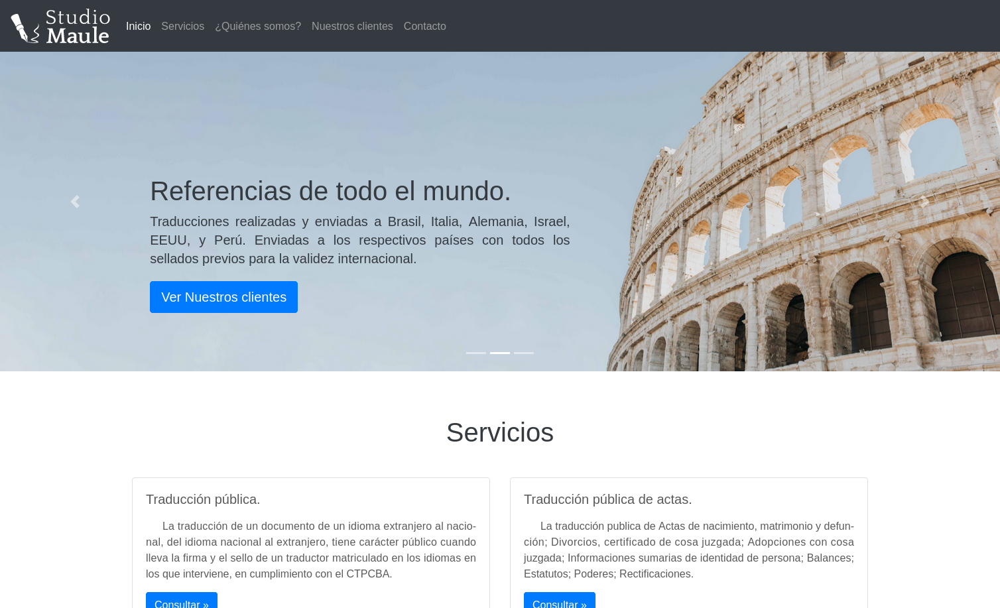
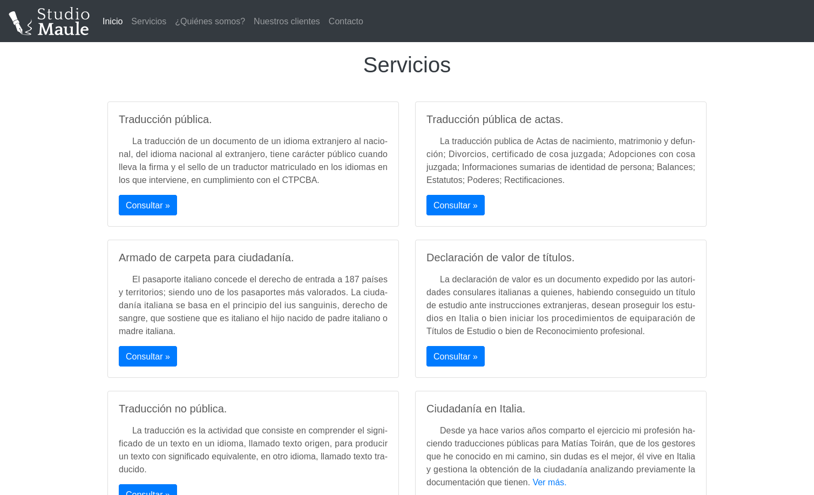
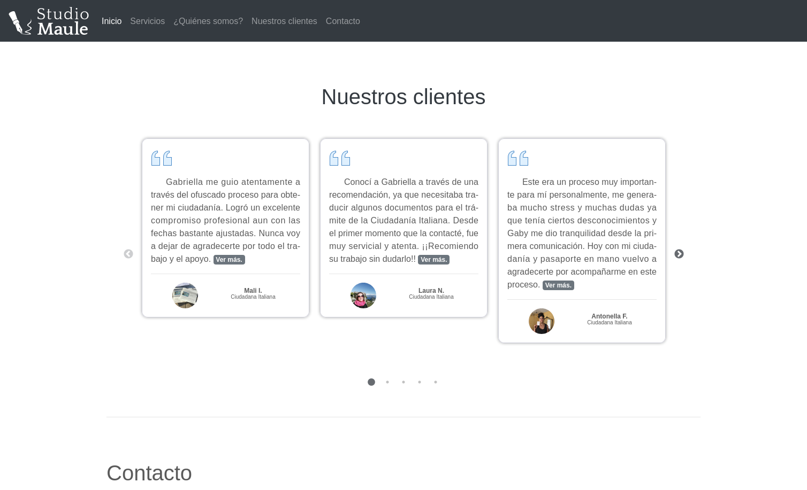
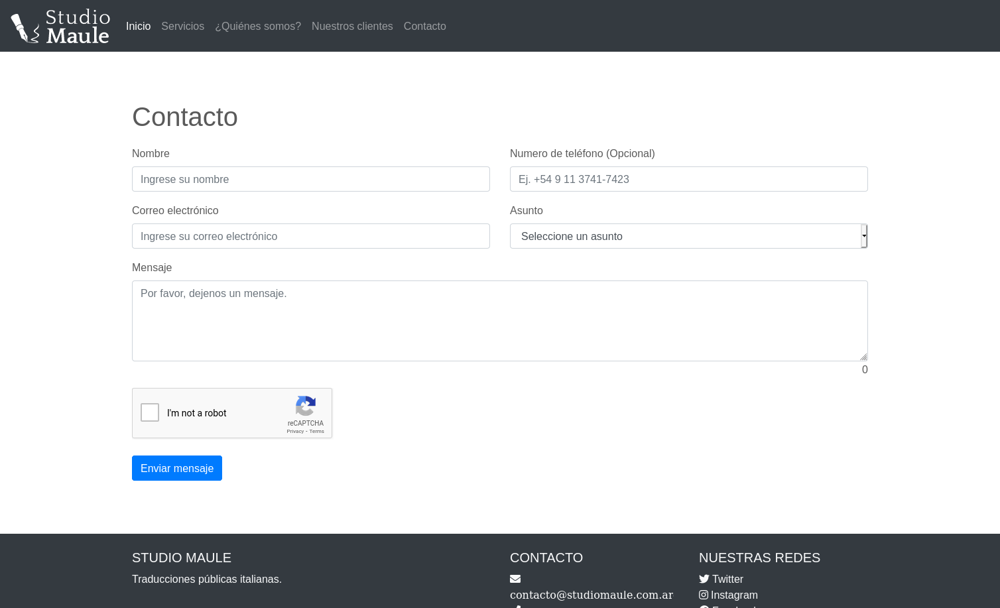
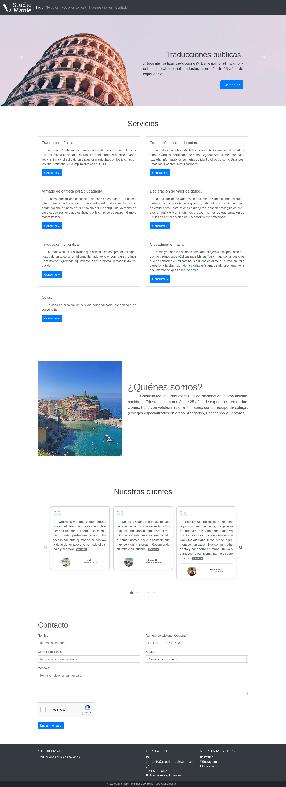

# Studio Maule Website
## Description
The project is about a landing page for a certified translation service based in Argentina. The page displays informational sections about the service in general, a customer review section, and a contact section.

The user is able to explore all the services offered and then send a contact message through a contact form. After the first contact, the communication continues via email.

## Technologies Used
- HTML5 and CSS3 with SASS
- Bootstrap 4.4
- JavaScript with jQuery
- Git Version Control
- WebPack 4
- Handlebars template engine
- Netlify hosting
- Netlify Serverless Functions (previously using AWS Lambda and GCP Functions)
- Google Recaptcha V2
- VSCode IDE with Prettier and ESLint (Airbnb style) 
- SendGrid Mail API (previously using Amazon SES)

## Screenshots

